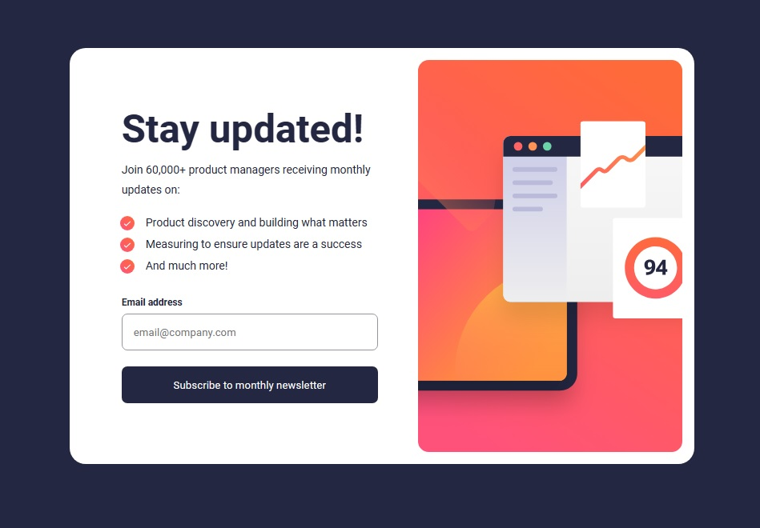
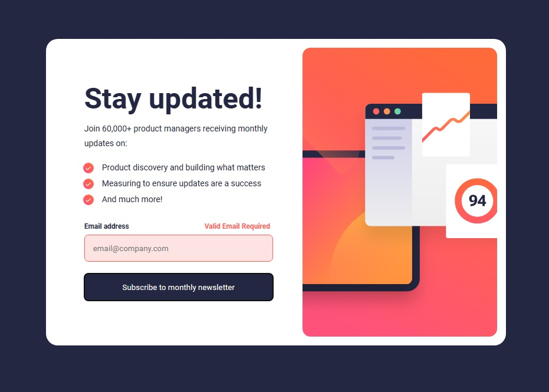

# DESAFIO - HTML/CSS/JS INTERMEDIÁRIO

Esta é uma solução para o desafio de [Formulário de inscrição na newsletter com mensagem de sucesso](
https://www.frontendmentor.io/challenges/newsletter-signup-form-with-success-message-3FC1AZbNrv
). Esse desafio visa testar minhas habilidades com estrutura básica de formulário, validação e envio.

## Índice

- [Visão geral](#visão-geral)
   - [O desafio](#o-desafio)
   - [Captura de tela](#captura-de-tela)
- [Meu processo](#meu-processo)
   - [Construído com](#construído-com)
   - [O que aprendi](#o-que-aprendi)

## Visão geral

### O desafio

O formulário consiste em:

- Ao clicar no botão submit, o campo de email address precisa estar devidamente preenchido. Se o campo não estiver preenchido ou não passar na validação de email, sua borda ficará vermelha e uma mensagem de "Valid Email Required" irá aparecer.
- Se o campo estiver corretamente preenchido, a validação e aprovada e o formulário é enviado. 

### Captura de tela

## Meu processo

### Construído com

- Marcação HTML5 semântica
- Propriedades personalizadas CSS
- Interação com JavaScript
- Manipulação de DOM

### O que eu aprendi

Esse desafio me proporcionou desenvolver técnicas práticas de interação com JavaScript e testar as habilidades com estrutura básica de formulário, validação e envio. O estado de sucesso foi uma excelente oportunidade para trabalhar com manipulação de DOM.